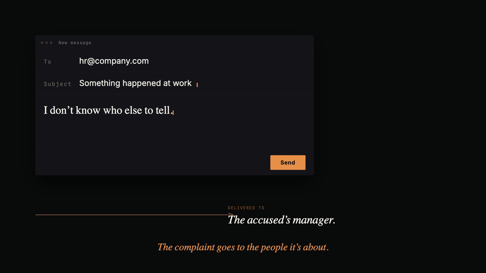

<p align="center">
  
</p>

<h1 align="center">Rakshak</h1>

<p align="center">
  <strong>रक्षक · "protector" in Sanskrit</strong><br>
  The AI-powered POSH workplace safety bot for Microsoft Teams.
</p>

<p align="center">
  <em>Because complaints shouldn&rsquo;t need courage.</em>
</p>

<p align="center">
  <a href="https://github.com/mohit67890/rakshak/raw/main/marketing/rakshak-launch.mp4">
    
  </a>
  <br>
  <sub>▶ <a href="https://github.com/mohit67890/rakshak/raw/main/marketing/rakshak-launch.mp4"><strong>Watch the 26-second demo</strong></a> · <a href="marketing/rakshak-launch-vertical.mp4">vertical cut</a></sub>
</p>

<p align="center">
  <a href="LICENSE"></a>
  <a href="#quick-start"></a>
  <a href="#testing"></a>
  <a href="#legal-framework"></a>
  <a href="#legal-framework"></a>
  <a href="#legal-framework"></a>
</p>

<p align="center">
  <a href="#why-rakshak-why-now">Why Now</a> ·
  <a href="#how-rakshak-is-different">How It&rsquo;s Different</a> ·
  <a href="#the-dead-mans-switch">Dead Man&rsquo;s Switch</a> ·
  <a href="#security--compliance">Security</a> ·
  <a href="#quick-start">Quick Start</a> ·
  <a href="#for-enterprises">For Enterprises</a>
</p>

---

## The 30-second pitch

Under India&rsquo;s POSH Act, every company with 10+ employees must run an Internal Complaints Committee. Most do — on paper. When complaints route through web forms and HR email IDs, they go to the same people who may be compromised. Employees give up. Committees stall. The 90-day statutory deadline slips by quietly.

**Rakshak puts the reporting channel inside the one app your workforce already uses — Microsoft Teams — as a private 1:1 bot that no manager, HR lead, or colleague can see.** The bot has an empathetic conversation, auto-generates a legally structured complaint citing specific POSH Act sections, and hands it to the ICC. If the ICC doesn&rsquo;t act within the configured window, an **automated escalation chain** routes the complaint to the Audit Committee, then the District Officer. No human permission required. Every action is logged to an immutable audit trail.

> Rakshak is the first POSH tool built for the **employee**, not the committee. Every existing product is an ICC dashboard. That&rsquo;s precisely the part of the pipeline that was already working.

---

## Why Rakshak, why now

Three converging pressures make this the wrong year to still be using a web form:

1. **Companies (Accounts) Second Amendment Rules, 2025** (effective July 14, 2025) now require the Board&rsquo;s Report to disclose POSH complaints received, resolved, and pending beyond 90 days. **Every listed company and large private company is now publicly accountable for these numbers.** Rakshak produces them automatically.
2. **The TCS Nashik case (April 2026)** — eight women harassed for four years while the HR head suppressed complaints — is the most visible failure of the status quo, but it is not unique. Every HR-routed intake has this structural weakness.
3. **Board-level liability** under Section 177 of the Companies Act makes the Audit Committee responsible for vigil mechanisms. Boards that don&rsquo;t act on escalated complaints inherit the risk personally.

If you&rsquo;re a Board, a CHRO, or a compliance officer, the question is no longer *&ldquo;should we digitise POSH?&rdquo;* — it&rsquo;s *&ldquo;will our current process survive audit and disclosure?&rdquo;*

---

## Who Rakshak is for

| You are… | Rakshak gives you… |
|---|---|
| **A CHRO or Compliance Officer** | A defensible, auditable intake process that meets every statutory deadline automatically, with Board-ready disclosure data on demand. |
| **A Board or Audit Committee member** | Visibility into complaints the ICC has failed to action within the statutory window — before they become a headline. Section 177 vigil mechanism compliance built in. |
| **A listed or large private company** | Automatic generation of the complaint data your Board&rsquo;s Report must now disclose under the Companies (Accounts) Rules 2025. |
| **A mid-market Indian company using Microsoft Teams** | Zero-footprint deployment — no new app for employees to install, no new credentials, SSO via Entra ID. You&rsquo;re live in a week. |
| **An employee who needs to report something** | A private channel that isn&rsquo;t owned by anyone who can hurt you. |

---

## How Rakshak is different

| What every other POSH tool does | What Rakshak does |
|---|---|
| Web form that routes to HR inbox | **Private 1:1 bot in Microsoft Teams.** HR, your manager, and your team cannot see the conversation. |
| Requires the employee to know legal terminology | **Empathetic LLM conversation** in plain language. The bot drafts a legally structured complaint citing specific POSH Act sections from what you tell it. |
| ICC dashboard — helps the committee, not the complainant | **Employee-first.** Rakshak is the only POSH tool that treats the reporter as the primary user. |
| If the ICC does nothing, nothing happens | **Dead man&rsquo;s switch** auto-escalates to the Audit Committee, then the District Officer. No human intervention. |
| No record if the complaint is suppressed | **Immutable, append-only audit log.** Every action timestamped. Cannot be edited or deleted. Tamper-evident, legally admissible. |
| 90-day inquiry deadline quietly lapses | **Automated deadline monitoring** with reminders. Breach triggers escalation. |
| Board-disclosure data compiled manually each year | **Auto-generated** per Companies (Accounts) Rules 2025 (coming in the annual-report module). |

The system makes complaint suppression **structurally impossible**.

---

## The dead man&rsquo;s switch

This is the feature no other POSH tool has. Powered by [Azure Durable Functions](https://learn.microsoft.com/en-us/azure/azure-functions/durable/durable-functions-overview).

```
Day 0   Complaint submitted  →  ICC notified (email + Teams)
Day 7   ICC hasn't acknowledged?      →  ICC reminder
Day 10  Still silent?                 →  Audit Committee notified  (Section 177 vigil mechanism)
Day 17  Still silent?                 →  District Officer notified  (POSH Act escalation path)
```

Each step checks whether the ICC has already acted — if they have, the chain terminates. If they haven&rsquo;t, it escalates. All timing is config-driven per tenant.

Separately, the **90-day inquiry deadline** (POSH Act, Section 11) is monitored from the moment the ICC acknowledges, with reminders at configurable intervals. A **daily safety-net cron** catches any complaint whose orchestration was lost to a restart — belt and suspenders.

See [docs/ESCALATION.md](docs/ESCALATION.md) for the full technical breakdown.

---

## Security & compliance

Rakshak handles the most sensitive data an organisation touches. Security isn&rsquo;t a feature — it&rsquo;s the foundation.

| Measure | Implementation |
|---|---|
| **Field-level encryption** | Complaint descriptions, names, and locations are encrypted at the application layer before reaching the database. Even DB administrators cannot read content. |
| **Private conversations only** | Bot operates exclusively in 1:1 personal scope. Never in group chats or channels. |
| **Multi-tenant data isolation** | All Cosmos DB containers partitioned by `tenantId`. Data for different organisations is physically separated. |
| **Immutable audit trail** | Every action (submission, acknowledgement, escalation, resolution) logged in an append-only audit store. No update or delete operations. |
| **Time-limited evidence access** | Evidence files use Azure Blob SAS tokens with 1-hour expiry. Raw blob URLs never exposed. |
| **SSRF protection** | Evidence download URLs validated against an allowlist of Microsoft domains before the bot fetches them. |
| **Scope-based API access** | Employees see only their own complaints. ICC members see only their tenant&rsquo;s complaints. Enforced at every endpoint. |
| **DPDPA 2023 ready** | Consent, purpose limitation, data minimization, and right to erasure implemented ahead of the May 2027 enforcement date. |

**Security disclosure:** If you find a vulnerability — especially relating to complaint data exposure, auth bypass, or encryption — please email **mohit@datapuls.ai** directly. Do not open a public issue.

---

## Features

### For employees
- **Conversational intake.** Talk to the bot like a trusted colleague. One question at a time, plain language, no legal jargon required.
- **Evidence upload.** Share screenshots, emails, documents in the chat or via the dashboard.
- **Real-time status tracking.** Check complaint status anytime via bot or the Dashboard tab.
- **Criminal-threshold detection.** If the incident crosses into criminal territory (Bharatiya Nyaya Sanhita §§ 74–79), the bot flags it for law-enforcement referral.

### For the ICC
- **Role-based dashboard** showing all complaints, timelines, and pending actions.
- **Acknowledge & respond** directly in the dashboard tab.
- **Deadline reminders** at configurable intervals before the 90-day statutory deadline.
- **Threaded comments** between ICC and complainant on each complaint.

### For the Board / Audit Committee
- **Escalation visibility** into complaints the ICC has failed to action within the configured window.
- **Section 177 vigil-mechanism compliance** via the second escalation level.
- **Board-disclosure data** per Companies (Accounts) Rules 2025 (roadmap: annual-report module).

---

## Legal framework

Rakshak&rsquo;s AI is grounded in five Indian legal pillars. Legal knowledge is baked into the LLM system prompt (not RAG) because the statutes are fixed and must be cited with 100% accuracy.

| Pillar | What it covers |
|---|---|
| **POSH Act, 2013** | Definition of sexual harassment, ICC constitution, complaint process, 90-day inquiry deadline, employer duties, penalties for non-compliance |
| **Bharatiya Nyaya Sanhita, 2023** (§§ 74–79) | Criminal offences: assault to outrage modesty, sexual harassment, voyeurism, stalking — Rakshak detects when complaints cross the POSH → criminal threshold |
| **Companies (Accounts) Rules, 2025** | Board&rsquo;s Report disclosure of complaints received, resolved, pending beyond 90 days |
| **Companies Act, 2013** (§ 177) | Vigil mechanism for listed companies — Rakshak&rsquo;s Audit-Committee escalation level satisfies this requirement |
| **DPDPA, 2023** | Consent, purpose limitation, data minimization, right to erasure |

---

## Tech stack

| Layer | Technology |
|---|---|
| Runtime | Node.js 20+ · TypeScript (strict) |
| Bot | Microsoft Bot Framework SDK v4 · Microsoft 365 Agents Toolkit |
| API | Azure Functions v4 |
| Orchestration | Azure Durable Functions v3 |
| Database | Azure Cosmos DB (NoSQL) |
| LLM | Azure OpenAI (GPT-5.4-mini) · Responses API with `store: true` |
| Storage | Azure Blob Storage (evidence, SAS-token gated) |
| Frontend | React 18 · Tailwind v4 · Fluent UI v9 · Framer Motion |
| Auth | Microsoft Entra ID |
| IaC | Azure Bicep |

---

## Quick start

### Prerequisites

- [Node.js](https://nodejs.org/) 20 or 22
- [Microsoft 365 Agents Toolkit](https://aka.ms/teams-toolkit) VS Code extension
- Azure subscription with Azure OpenAI (GPT-5.4-mini), Cosmos DB, Blob Storage
- A Microsoft 365 developer tenant (or sandbox)

### 1. Clone and install

```bash
git clone https://github.com/mohit67890/rakshak.git
cd rakshak
npm install && (cd api && npm install) && (cd tab && npm install)
```

### 2. Configure environment

```bash
cp env/.env.dev.example env/.env.dev
cp env/.env.playground.example env/.env.playground
cp api/local.settings.example.json api/local.settings.json
```

Fill in: `AZURE_OPENAI_ENDPOINT`, `AZURE_OPENAI_API_KEY`, `AZURE_OPENAI_DEPLOYMENT_NAME`, `COSMOS_ENDPOINT`, `COSMOS_KEY`, `COSMOS_DATABASE`, `BOT_ID`.

### 3. Set up the database

```bash
cd scripts && node setup-cosmos.mjs
```

Creates the database and all 6 containers: `complaints`, `conversations`, `messages`, `auditLogs`, `iccConfig`, `comments`.

### 4. Run it

**Teams (recommended):** press **F5** in VS Code with the Agents Toolkit — provisions the bot, starts a dev tunnel, sideloads the app.

**Agents Playground:** `npm run dev:teamsfx:playground` then `npm run dev:teamsfx:launch-playground`.

### 5. Start the API

```bash
npx azurite --silent --location .azurite &
cd api && func start
```

### 6. Run the tests

```bash
npm test  # 159 tests across 4 suites
```

Detailed setup: [docs/SETUP.md](docs/SETUP.md).

---

## Architecture

```
┌────────────────────────────────────────────────────────────────┐
│                     Microsoft Teams                            │
│  ┌──────────────────┐  ┌────────────────────────────────────┐  │
│  │    Bot (1:1)      │  │          Tab (Dashboard)           │  │
│  │  Conversation     │  │  Employee: My Complaints           │  │
│  │  Intake → LLM     │  │  ICC: All Cases + Actions          │  │
│  └────────┬─────────┘  └──────────────┬─────────────────────┘  │
└───────────┼───────────────────────────┼────────────────────────┘
            │                           │
            ▼                           ▼
┌───────────────────┐      ┌─────────────────────────┐
│   Bot Server      │      │   Azure Functions API    │
│   (Node.js)       │      │   HTTP + Durable          │
└────────┬──────────┘      └──────────┬──────────────┘
         │                            │
         ▼                            ▼
┌─────────────────────────────────────────────────────┐
│  Cosmos DB · Blob Storage · Azure OpenAI            │
│  Graph API (email) · Bot Framework (proactive)      │
└─────────────────────────────────────────────────────┘
```

Deep-dive: [docs/ARCHITECTURE.md](docs/ARCHITECTURE.md) · Escalation internals: [docs/ESCALATION.md](docs/ESCALATION.md).

---

## Testing

**4 suites · 159 tests:**

| Suite | Covers |
|---|---|
| `e2e.test.ts` | Complete conversation lifecycle: welcome → listening → review → submit |
| `api.test.ts` | HTTP triggers, Durable activities, orchestrator step-through |
| `orchestration.test.ts` | Config validation, notification templates, escalation timing, audience resolution |
| `api.integration.test.ts` | Real Cosmos DB operations against a test database |

---

## Roadmap

**Shipped**

- [x] Conversational complaint intake with LLM-guided empathetic questioning
- [x] Evidence upload pipeline (bot + dashboard + SAS-gated Blob Storage)
- [x] Dead man&rsquo;s switch — multi-level escalation with durable timers
- [x] 90-day inquiry-deadline monitoring with configurable reminders
- [x] ICC + Employee dashboard tabs with role-based routing
- [x] Threaded comments on complaints
- [x] Immutable audit logging
- [x] Daily safety-net cron for missed orchestrations
- [x] Config-driven notification system (email, proactive bot, activity feed)
- [x] Criminal-threshold detection during LLM intake
- [x] 159 tests across 4 suites

**Next**

- [ ] Criminal-threshold alerts surfaced in the ICC dashboard
- [ ] Client-side PDF export on the complaint detail view
- [ ] **Annual-report orchestrator** — auto-generate the Board&rsquo;s POSH disclosure data mandated by Companies (Accounts) Rules 2025
- [ ] Multi-language support (Hindi, Marathi, Tamil, Telugu)
- [ ] Anonymous reporting mode
- [ ] AppSource marketplace listing
- [ ] WhatsApp / SMS channels

---

## For enterprises

Rakshak is **open-source and self-hosted** — your complaint data never leaves your Azure tenant. The MIT license means you can deploy, modify, and extend it freely.

If you want help with rollout, ICC training, custom workflows, or an annual compliance retainer, reach out at **mohit@datapuls.ai** — I&rsquo;m happy to work directly with a small number of companies doing this seriously.

**Evaluating Rakshak?** The fastest path is:
1. Watch the [26-second demo](https://github.com/mohit67890/rakshak/raw/main/marketing/rakshak-launch.mp4).
2. Read [how the dead man&rsquo;s switch works](docs/ESCALATION.md).
3. Star the repo, or open an issue with questions.
4. Run the [Quick Start](#quick-start) locally (< 30 min with the prerequisites in place).

---

## Contributing

See [CONTRIBUTING.md](CONTRIBUTING.md). Contributions — especially from those with POSH Act expertise, HR experience, or regional labour-law knowledge — are deeply welcome.

## License

[MIT](LICENSE) — free to use, modify, and distribute.

---

<p align="center">
  <sub>Built with quiet determination for the people who needed it and didn&rsquo;t have the tools.</sub><br>
  <sub>Made by <strong>Mohit Garg</strong> · <a href="mailto:mohit@datapuls.ai">mohit@datapuls.ai</a> · <a href="https://x.com/mohitt_garg">𝕏</a> · <a href="https://www.linkedin.com/in/mohitga/">LinkedIn</a></sub>
</p>
